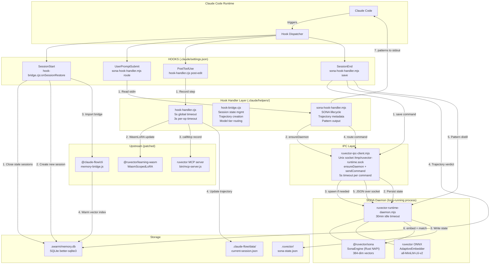

# Bootstrapped Self-Learning System — Actual Hook Status

> Generated 2026-04-09 via GitNexus xref MCP analysis of 8 indexed repos

## Hook Architecture Diagram



## Hook Flow Detail

### 1. SessionStart

```
Claude Code → hook-bridge.cjs:onSessionRestore()
  → Close stale sessions/trajectories in SQLite
  → Create new session record
  → Import memory-bridge.js (patched @claude-flow/cli)
  → Warm AgentDB vector index from disk
```

### 2. UserPromptSubmit (every prompt)

```
Claude Code → sona-hook-handler.mjs route
  → Read prompt from stdin
  → ensureDaemon() — auto-starts ruvector-runtime-daemon if not running
  → sendCommand({type:'route', prompt}) via Unix socket IPC
  → Daemon: SONA embed(prompt) → match patterns → return routing
  → Output [INTELLIGENCE] patterns + routing recommendation to stdout
  → Claude Code reads stdout → enriches context
```

### 3. PostToolUse (every tool call)

```
Claude Code → hook-handler.cjs post-edit
  → WasmScopedLoRA.apply() — MicroLoRA instant learning (<100µs)
  → callMcp(record-step) — HTTP to warm MCP server
  → Update trajectory step count in session state
  → 3s timeout per operation, 5s global kill
```

### 4. SessionEnd

```
Claude Code → sona-hook-handler.mjs save
  → sendCommand({type:'save'}) via IPC
  → Daemon: persist SONA state to .ruvector/sona-state.json
  → Write trajectory verdict to SQLite
  → Pattern distillation (extract learned patterns from trajectory)
```

## Key Architecture Decisions

- **Hooks never import lock-holding modules** (FoxRef Q2) — all heavy work via IPC to daemon
- **Daemon owns all Rust NAPI + ONNX resources** — single process, no lock contention
- **3-tier timeout**: 100µs (WASM LoRA) → 3s (per-op) → 5s (global hook kill)
- **IPC over Unix socket** — no HTTP overhead for daemon comms, 5s timeout
- **MCP HTTP for AgentDB** — warm MCP server handles rich engine features

---

## Runtime Symbol Provenance

Every symbol in the system, where it comes from, and what patch makes it work.

### Hook Handler Layer (installed by bootstrap)

| File | Patch | Origin |
|------|-------|--------|
| `.claude/helpers/hook-handler.cjs` | PATCH 090 | bootstrap-authored |
| `.claude/helpers/hook-bridge.cjs` | PATCH 090 | bootstrap-authored |
| `.claude/helpers/sona-hook-handler.mjs` | PATCH 090 | bootstrap-authored |
| `.claude/helpers/ruvector-ipc-client.mjs` | PATCH 090 | bootstrap-authored |
| `.claude/helpers/ruvector-runtime-daemon.mjs` | PATCH 120 | bootstrap-authored |
| `.claude/helpers/auto-memory-hook.mjs` | PATCH 130 | bootstrap-authored |
| `.claude/helpers/intelligence.cjs` | PATCH 140 | bootstrap-authored |
| `.claude/helpers/daemon-manager.sh` | PATCH 170 | bootstrap-authored |
| `.claude/settings.json` | PATCH 100 | bootstrap-authored (wires all hooks) |

100% bootstrap-authored — none of these exist in upstream ruflo/ruvector.

### SONA Learning Engine

| Symbol | Package | Repo | Patches |
|--------|---------|------|---------|
| `SonaEngine` | `@ruvector/sona` (Rust NAPI) | ruvector `crates/ruvector-sona/` | PATCH 150 — `Intelligence.load()` drops activeTrajectories (T3 persistence bug) |
| `.embed(text)` | 384-dim vectors | | |
| `.matchPatterns()` | pattern matching | | |
| `.recordStep()` | trajectory recording | | |
| `.distill()` | pattern distillation | | |

### ONNX Embeddings

| Symbol | Package | Repo | Patches |
|--------|---------|------|---------|
| `AdaptiveEmbedder` | `ruvector` (main package) | ruvector `npm/packages/ruvector/` | None — works as-is |
| `OptimizedOnnxEmbedder` | fallback embedder | | |
| `initOnnxEmbedder()` | model initialization | | |

### WASM MicroLoRA

| Symbol | Package | Repo | Patches |
|--------|---------|------|---------|
| `WasmScopedLoRA` | `@ruvector/learning-wasm` | ruvector `crates/ruvector-attention-wasm/` | PATCH 027 — copies patched WASM JS bindings (upstream pkg missing) |
| `WasmFlashAttention` | WASM bindings | | |
| `WasmAdam`, `WasmAdamW` | optimizers | | |
| `WasmInfoNCELoss` | loss function | | |
| `WasmLRScheduler` | training | | |

### AgentDB (Vector Store)

| Symbol | Package | Repo | Patches |
|--------|---------|------|---------|
| `AgentDB` | `agentdb` (npm) | agentic-flow `packages/agentdb/` | PATCH 020 — init + CLI exit |
| `.store(key, vector)` | SQLite + vectors | | PATCH 021 — HierarchicalMemory |
| `.search(query, k)` | HNSW index | | PATCH 022 — LearningSystem (RL) |
| `.warmVectorIndex()` | | | PATCH 023 — HNSWLibBackend |
| `HierarchicalMemory` | agentdb controllers | | PATCH 025 — SONA export missing |
| `LearningSystem` | agentdb controllers | | PATCH 030 — HM/MC exports |
| `HNSWLibBackend` | agentdb backends | | PATCH 033 — controllers/index.js |
| | | | PATCH 040 — agentic-flow core AgentDB.js |
| | | | PATCH 050 — agentdb-service.js |

### ControllerRegistry

| Symbol | Package | Repo | Patches |
|--------|---------|------|---------|
| `ControllerRegistry` | `@claude-flow/memory` | ruflo `v3/@claude-flow/memory/` | PATCH 024 — enable (disabled by default) |
| `.getAgentDB()` | orchestrates all controllers | | PATCH 060 — require('path') in ESM (RFP-002a) |
| `.searchEntries()` | | | PATCH 060 — embedder in constructors (RFP-006) |

### Memory Bridge

| Symbol | Package | Repo | Patches |
|--------|---------|------|---------|
| `bridgeSessionStart()` | `@claude-flow/cli` | ruflo `v3/@claude-flow/cli/` | PATCH 070 — memory-bridge.js imports |
| `getControllerRegistry()` | memory/memory-bridge.js | | PATCH 080 — memory-initializer.js startup |

### MCP Server

| Symbol | Package | Repo | Patches |
|--------|---------|------|---------|
| `convertLegacyData()` | `ruvector/bin/mcp-server.js` | ruvector `npm/packages/ruvector/` | PATCH 029 — intelligence.json format |
| Intelligence API | HTTP RPC on localhost | | PATCH 035 — MCP HTTP transport |

### SONA Optimizer

| Symbol | Package | Repo | Patches |
|--------|---------|------|---------|
| `SonaOptimizer` | `@claude-flow/cli` | ruflo `v3/@claude-flow/cli/` | PATCH 026 — base fix |
| `.optimize()` | services/sona-optimizer.js | | PATCH 112 — deep pipeline |
| `.forceLearn()` | | | PATCH 114 — native constructor |
| | | | PATCH 116 — forceLearn |
| | | | PATCH 117 — trajectory persistence |
| | | | PATCH 118 — distill learning call |
| | | | PATCH 119 — state persistence |

### Worker System

| Symbol | Package | Repo | Patches |
|--------|---------|------|---------|
| `headlessWorkerExecutor` | `@claude-flow/cli` | ruflo `v3/@claude-flow/cli/` | PATCH 160 — executor fix |
| `workerDaemon` | services/ | | PATCH 120 — daemon service |

### Hooks & Intelligence

| Symbol | Package | Repo | Patches |
|--------|---------|------|---------|
| `hooks-tools.js` | `@claude-flow/cli` | ruflo `v3/@claude-flow/cli/` | PATCH 111 — learn integration |
| `learning-service.mjs` | services/ | | PATCH 113 — model route filepath |
| `learning-hooks.sh` | | | PATCH 115 — pattern embeddings |
| | | | PATCH 180 — learning service |
| | | | PATCH 190 — learning hooks |

### Infrastructure

| Symbol | Package | Repo | Patches |
|--------|---------|------|---------|
| `agentic-flow/package.json` | `agentic-flow` | agentic-flow | PATCH 010 — missing `./embeddings` export (RFP-001) |
| `ruvector/bin/cli.js` | `ruvector` CLI | ruvector | PATCH 031 — CLI fixes |
| | | | PATCH 150 — T3 trajectory persistence |

---

## Storage (local, no package)

| Path | Format | Created by |
|------|--------|-----------|
| `.swarm/memory.db` | SQLite (better-sqlite3) | Runtime — sessions, trajectories, patterns, vectors |
| `.claude-flow/data/current-session.json` | JSON | hook-bridge.cjs — sessionId, stepCount, trajectoryId |
| `.ruvector/sona-state.json` | JSON | ruvector-runtime-daemon.mjs — SONA learned state |
| `/tmp/ruvector-runtime.sock` | Unix socket | ruvector-runtime-daemon.mjs — IPC channel |
| `/tmp/sona-trajectories/` | JSON files | sona-hook-handler.mjs — trajectory metadata |

---

## Package Provenance Summary

| Package | Source Repo | Patches | What It Does |
|---------|------------|---------|-------------|
| `@ruvector/sona` | ruvector | 150 | Rust SONA learning engine |
| `ruvector` (main) | ruvector | 029, 031 | ONNX embeddings + CLI |
| `@ruvector/learning-wasm` | ruvector | 027 | WASM MicroLoRA |
| `agentdb` | agentic-flow | 020-033 | Vector store + controllers |
| `agentic-flow` | agentic-flow | 010, 040 | Agent framework |
| `@claude-flow/cli` | ruflo | 070-190 | CLI + services + memory |
| `@claude-flow/memory` | ruflo | 024, 060 | ControllerRegistry |
| `better-sqlite3` | npm (third-party) | none | SQLite binding |

**Total: 8 packages from 3 repos, 43 patches to make it work.**
